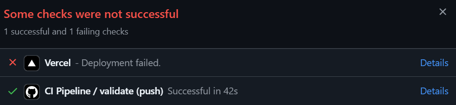
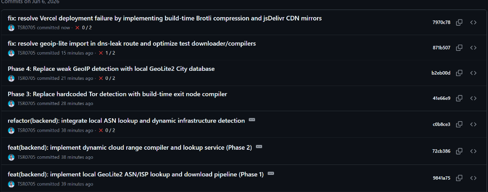

# WHO-I-AM: Privacy Diagnostics & Location Intelligence Hub

**WHO-I-AM** is an advanced privacy diagnostics platform designed to analyze client network routing, browser properties, and hardware fingerprints to expose what metadata is leaked to web servers. 

Unlike traditional services, WHO-I-AM runs a **completely offline local intelligence pipeline**, executing zero-latency database checks in-memory without sending user data to third-party APIs.

---

## 1. System Architecture

WHO-I-AM is designed as a polyglot monorepo deployed via Vercel Services:


---

## 2. Core Features

* **Local ASN & Geolocation Engines**: In-memory lookups of country, region, city, coordinates, and ISP using Brotli-compressed MaxMind databases.
* **Infrastructure Identification**: Identifies AWS, Google Cloud, and Cloudflare subnets via binary search ($O(\log N)$) across IPv4 and IPv6 space.
* **Offline Tor Detection**: Evaluates client IPs against pre-compiled exit node datasets.
* **Canvas, WebGL, & Audio Fingerprinting**: Generates cryptographic device signatures to measure browser uniqueness ratios.
* **DNS Leak Diagnostic**: Deploys a custom UDP DNS server that checks if system lookup paths route outside secure VPN tunnels.
* **WebRTC LAN Exposure**: Identifies private local IP leakage (RFC 1918) through browser STUN negotiations.

---

## 3. Screenshots

*Landing Page Backdrop Control Panel*



*Diagnostic Logs Terminal Console*



---

## 4. Quick Start

### Installation
From the root workspace directory, install all packages:
```bash
npm install
```

### Compile Intelligence Datasets
Generate local databases and offline CDN feeds:
```bash
# Download and Brotli-compress MaxMind tables
node apps/backend/scripts/download-db.js --force

# Compile cloud ranges
npx ts-node apps/backend/scripts/compile-infra.ts --force

# Compile Tor exit nodes
npx ts-node apps/backend/scripts/compile-tor.ts --force
```

### Start Development Server
```bash
npm run dev
```

---

## 5. Documentation Hub

Explore the detailed documentation files under `docs/`:

* **[Executive Overview](docs/executive_overview.md)**: High-level summary of innovation and technical complexity.
* **[Technical Architecture](docs/technical_architecture.md)**: Monorepo routing, data flows, and Express request lifecycles.
* **[Backend Manual](docs/backend.md)**: Router endpoints, Express middleware, and background services.
* **[Frontend Guide](docs/frontend.md)**: Next.js App Router, custom hooks, and React visualizations.
* **[Intelligence Layer Details](docs/intelligence_engine.md)**: Implementation mechanics of ASN, cloud subnets, Tor exits, and GeoIP.
* **[Database & Storage Schema](docs/database.md)**: PostgreSQL schemas, indices, and file-based fallback mechanisms.
* **[Deployment & Configuration Guide](docs/deployment.md)**: Local, Docker, and Vercel monorepo deployment guides.
* **[API Reference](docs/api.md)**: Exhaustive manual of endpoint paths, payloads, and JSON response models.
* **[Developer Handbook](docs/developer_handbook.md)**: TypeScript style conventions, candidate maps, and path resolution rules.
* **[Contributor Onboarding](docs/contributing.md)**: Onboarding instructions, unit testing, and service extension guides.
* **[Design Decisions & Tradeoffs](docs/design_decisions.md)**: In-depth rationale behind offline design patterns and Brotli compression.
* **[Phased Roadmap](docs/roadmap.md)**: Progress details for Phases 1-4 and planned features for Phases 5-7.
