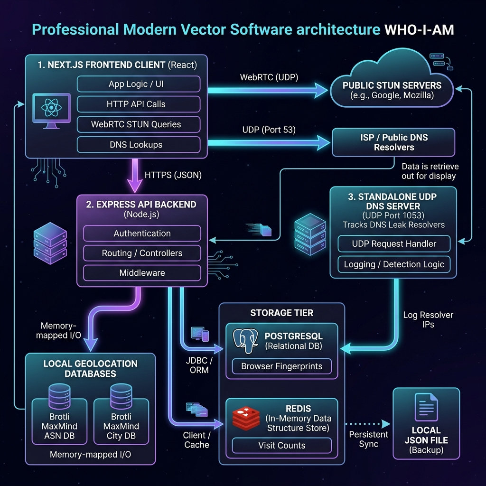

<div align="center">

# 🕵️‍♂️ WHO-I-AM

**The Ultimate Privacy Diagnostics & Location Intelligence Hub**

[](https://opensource.org/licenses/MIT)
[](https://www.typescriptlang.org/)
[](https://vercel.com/)
[](https://nextjs.org/)
[](https://expressjs.com/)

[**Explore Documentation**](docs/README.md) · [**Report Bug**](https://github.com/TSR0705/WHO-I-AM/issues) · [**Request Feature**](https://github.com/TSR0705/WHO-I-AM/issues)

</div>

---

**WHO-I-AM** is an advanced privacy diagnostics platform designed to analyze client network routing, browser properties, and hardware fingerprints to expose what metadata is leaked to web servers. 

Unlike traditional services, WHO-I-AM runs a **hybrid local/cloud intelligence pipeline**, executing zero-latency GeoIP and Anonymization database checks locally in-memory, while offloading uniqueness calculations and DNS leak diagnostics to external services.

---

## 📖 Table of Contents

- [✨ Core Features](#-core-features)
- [🏗️ System Architecture](#️-system-architecture)
- [🚀 Quick Start](#-quick-start)
- [📚 Documentation Hub](#-documentation-hub)
- [🤝 Contributing](#-contributing)
- [📄 License](#-license)

---

## ✨ Core Features

WHO-I-AM implements bleeding-edge privacy diagnostic capabilities entirely in-house:

* **🌍 Local ASN & Geolocation Engines:** In-memory lookups of country, region, city, coordinates, and ISP using Brotli-compressed MaxMind databases.
* **☁️ Infrastructure Identification:** Identifies AWS, Google Cloud, and Cloudflare subnets via fast binary search ($O(\log N)$) across IPv4 and IPv6 space.
* **🧅 Offline Tor Detection:** Evaluates client IPs against dynamically pre-compiled exit node datasets.
* **🧩 Advanced Fingerprinting:** Generates device hashes via Canvas, WebGL, and Audio contexts, comparing them against a central PostgreSQL database to measure browser uniqueness ratios. Note: Identical hardware/software setups may yield identical hashes.
* **🛡️ DNS Leak Diagnostic:** Deploys a custom UDP DNS server that catches dynamic subdomain lookups to check if system requests route outside secure VPN tunnels.
* **🕸️ WebRTC LAN Exposure:** Identifies private local IP leakage (RFC 1918) through browser STUN negotiations.

---

## 🏗️ System Architecture

WHO-I-AM is designed as a polyglot monorepo deployed seamlessly via Vercel Services.

<div align="center">
  
</div>

---

## 🚀 Quick Start

Get WHO-I-AM running locally in minutes.

### 1. Installation

From the root workspace directory, install all dependencies:
```bash
npm install
```

### 2. Compile Intelligence Datasets

Generate the local databases and offline CDN feeds required for the intelligence engine:

```bash
# Download and Brotli-compress MaxMind tables
node apps/backend/scripts/download-db.js --force

# Compile cloud infrastructure IP ranges
npx ts-node apps/backend/scripts/compile-infra.ts --force

# Compile Tor exit nodes list
npx ts-node apps/backend/scripts/compile-tor.ts --force
```

### 3. Start Development Server

Run the full stack (Frontend & Backend):
```bash
npm run dev
```

Visit `http://localhost:3000` to view the application.

---

## 📚 Documentation Hub

We maintain comprehensive documentation for all aspects of the system. Explore the detailed files under the `docs/` directory:

| Section | Description |
|---------|-------------|
| 🎯 **[Executive Overview](docs/executive_overview.md)** | High-level summary of innovation, goals, and technical complexity. |
| 🏗️ **[Technical Architecture](docs/technical_architecture.md)** | Monorepo routing, data flows, and request lifecycles. |
| ⚙️ **[Backend Manual](docs/backend.md)** | Express routers, middleware, and background intelligence services. |
| 🎨 **[Frontend Guide](docs/frontend.md)** | Next.js App Router, custom React hooks, and visualizations. |
| 🧠 **[Intelligence Engine](docs/intelligence_engine.md)** | Implementation mechanics of ASN, cloud subnets, Tor, and GeoIP. |
| 🗄️ **[Database Schema](docs/database.md)** | PostgreSQL schemas, indexes, and offline file-based fallback strategies. |
| 🚀 **[Deployment Guide](docs/deployment.md)** | Complete guide for Local, Docker, and Vercel monorepo deployments. |
| 🔌 **[API Reference](docs/api.md)** | Exhaustive manual of endpoint paths, payloads, and JSON models. |
| 🧑‍💻 **[Developer Handbook](docs/developer_handbook.md)** | TypeScript style conventions and architectural decision records. |
| 🤝 **[Contributor Onboarding](docs/contributing.md)** | Setup instructions, unit testing, and service extension guides. |
| ⚖️ **[Design Decisions](docs/design_decisions.md)** | In-depth rationale behind offline design patterns and optimizations. |
| 🗺️ **[Phased Roadmap](docs/roadmap.md)** | Progress details for completed phases and upcoming privacy features. |

---

## 🤝 Contributing

Contributions are what make the open source community such an amazing place to learn, inspire, and create. Any contributions you make are **greatly appreciated**.

1. Fork the Project
2. Create your Feature Branch (`git checkout -b feature/AmazingFeature`)
3. Commit your Changes (`git commit -m 'feat: Add some AmazingFeature'`)
4. Push to the Branch (`git push origin feature/AmazingFeature`)
5. Open a Pull Request

Please refer to our [Contributing Guide](docs/contributing.md) for more details.

---

## 📄 License

Distributed under the MIT License. See `LICENSE` for more information.

<div align="center">
  <br>
  Built with ❤️ for privacy and security.
</div>
