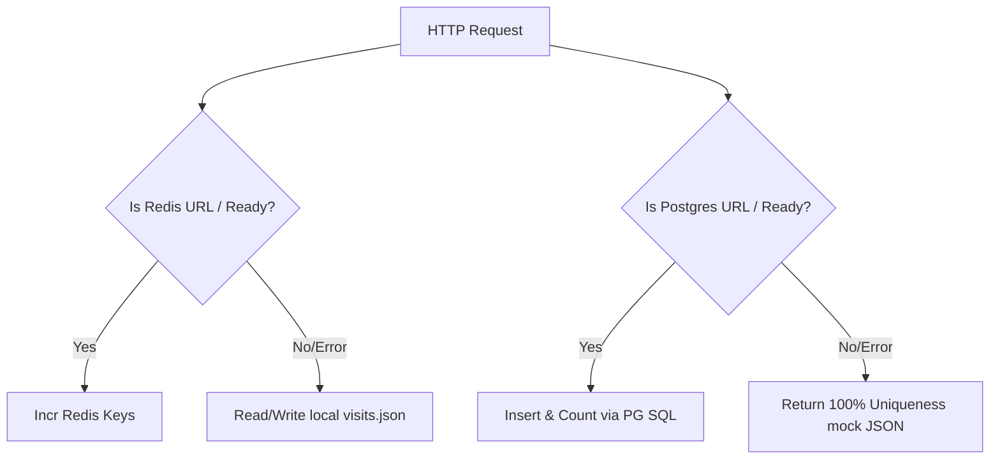

# WHO-I-AM: Database Documentation

This document describes the schema, index strategies, fingerprint calculation algorithms, and fallback architectures of the database layers inside WHO-I-AM.

---

## 1. PostgreSQL Schema Design

The relational database layer persists client browser fingerprints to compute comparative population statistics.

### Schema Blueprint (`src/services/db.ts`):
```sql
CREATE TABLE IF NOT EXISTS fingerprints (
  id SERIAL PRIMARY KEY,
  canvas_hash VARCHAR(64) NOT NULL,
  audio_hash VARCHAR(64) NOT NULL,
  browser VARCHAR(255) NOT NULL,
  os VARCHAR(255) NOT NULL,
  device VARCHAR(100) NOT NULL,
  created_at TIMESTAMP DEFAULT CURRENT_TIMESTAMP
);
```

### Index Strategy:
To optimize the aggregation queries executed during the fingerprint submission lifecycle, two custom indexes are applied:
* **`idx_canvas_hash`**: `CREATE INDEX IF NOT EXISTS idx_canvas_hash ON fingerprints(canvas_hash);`
* **`idx_audio_hash`**: `CREATE INDEX IF NOT EXISTS idx_audio_hash ON fingerprints(audio_hash);`

These indexes reduce lookup latency from $O(N)$ sequential table scans to $O(\log N)$ index seeks, maintaining dashboard load times as the dataset grows.

---

## 2. Fingerprint Uniqueness Logic

During the POST `/api/fingerprint` request lifecycle, the server executes three database queries to calculate the fingerprint uniqueness percentage:

1. **Insert Record**:
   ```sql
   INSERT INTO fingerprints (canvas_hash, audio_hash, browser, os, device) 
   VALUES ($1, $2, $3, $4, $5)
   ```
2. **Retrieve Dataset Total**:
   ```sql
   SELECT COUNT(*) FROM fingerprints
   ```
3. **Retrieve Matches Count**:
   ```sql
   SELECT COUNT(*) FROM fingerprints WHERE canvas_hash = $1;
   SELECT COUNT(*) FROM fingerprints WHERE audio_hash = $1;
   ```

### Calculation Algorithm:
$$\text{Shared Percentage} = \left( \frac{\text{matching\_count}}{\text{total\_count}} \right) \times 100$$
$$\text{Is Unique} = \text{matching\_count} \le 1$$

---

## 3. Database Connection Security (SSL)

To ensure secure data transit when connecting to modern managed database endpoints (e.g., Supabase, Neon, Vercel Postgres), the Pg connection Pool validates:
* **Local Connection Bypass**: Bypasses SSL requirements for loopback configurations (addresses containing `localhost` or `127.0.0.1`).
* **SSL Requirement**: Forces SSL with `rejectUnauthorized: false` for all external connection strings to ensure compatibility with cloud database services.

---

## 4. Resilience and Fallback Architecture

To support serverless environments (like Vercel Hobby limits or container restarts) and local dev environments without Postgres/Redis, WHO-I-AM implements a **graceful degradation protocol**:



### visits.json Schema Fallback:
If Redis is not configured, visit details are stored in the local file `apps/backend/visits.json`:
```json
{
  "total": 12,
  "byIp": {
    "127.0.0.1": 3,
    "8.8.8.8": 1
  }
}
```

### DNS Resolver Fallback:
If Redis is absent, DNS leak resolver IPs are temporarily held in an in-memory Node map `dnsCache`.
