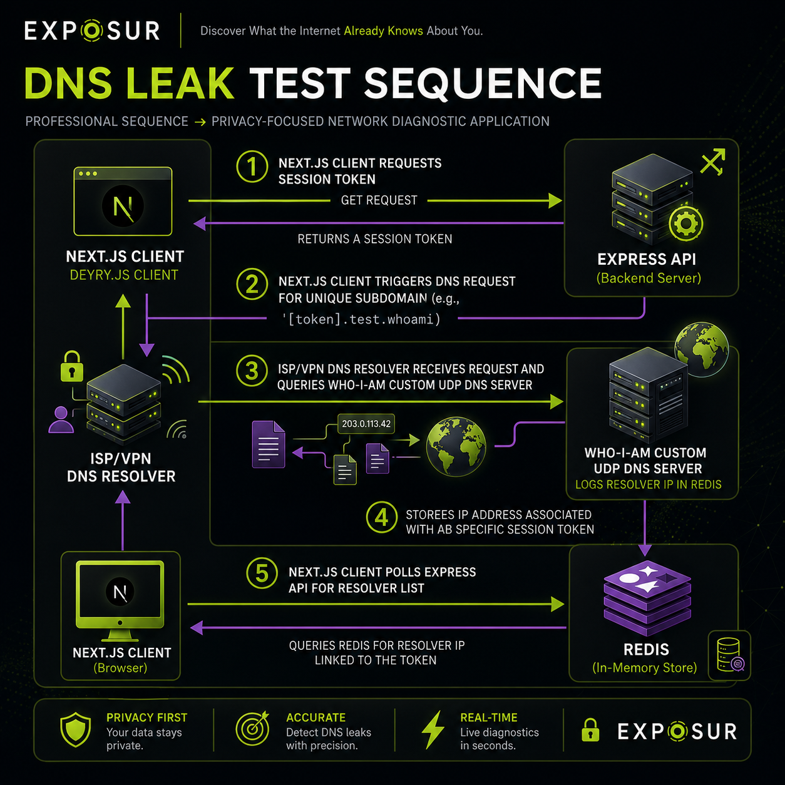

# Exposur: Technical Architecture Document

This document provides a comprehensive analysis of the system architecture, directory topology, data flows, and request lifecycles of the Exposur application.

---

## 1. Directory Structure and Monorepo Layout

Exposur is organized as an npm monorepo with decoupled frontend and backend workspaces under `apps/`:

```text
Exposur-main/
├── apps/
│   ├── backend/                 # Node.js/Express service
│   │   ├── src/
│   │   │   ├── config/          # Environment configuration
│   │   │   ├── data/            # Local databases (.mmdb.br, .json)
│   │   │   ├── routes/          # Express API route modules
│   │   │   ├── services/        # Business logic services
│   │   │   ├── index.ts         # Express server core
│   │   │   └── dns-server.ts    # Standalone UDP DNS server class
│   │   ├── scripts/             # Build-time compilers & downloaders
│   │   └── package.json
│   │
│   └── frontend/                # Next.js frontend web app
│       ├── src/
│       │   ├── app/             # App Router pages and custom hooks
│       │   ├── components/      # UI Dashboard components and widgets
│       │   └── utils/           # Client-side fingerprint harvesting
│       └── package.json
│
├── vercel.json                  # Multi-project deployment configuration
├── package.json                 # Monorepo workspaces definitions
└── docs/                        # Complete documentation hub
```

---

## 2. Monorepo Multi-Project Routing (Vercel)

Under Vercel, the application is deployed as **Vercel Services** via `vercel.json` (configured in the root):
* **Frontend Service**:
  * **Root**: `apps/frontend`
  * **Framework**: `nextjs`
  * **Route Prefix**: `/`
* **Backend Service**:
  * **Root**: `apps/backend`
  * **Builder**: `@vercel/node`
  * **Route Prefix**: `/api`
  * **Entrypoint**: `src/index.ts`
  * **IncludeFiles**: Traces compressed Brotli databases and pre-compiled JSON feeds to package them into the serverless deployment bundle.

---

## 3. Data Flow Scenarios

### Scenario A: Network Diagnostics (`/api/whoami`)


### Scenario B: DNS Leak Diagnostic Pipeline



---

## 4. Backend Request Lifecycle

Every HTTP request sent to the Express API traverses the following middleware stack:

1. **Security Headers (Helmet)**:
   * Sets secure HTTP headers.
   * Configures Content Security Policy (CSP) allowing only trusted origins for style, script, connect, and image sources.
2. **CORS Middleware**:
   * Evaluates incoming requests against the `ALLOWED_ORIGIN` environment variable.
3. **Client IP Resolver (`requestIp.mw()`)**:
   * Inspects proxy headers (`x-forwarded-for`, `x-real-ip`, etc.) and attaches the normalized client IP string to the request context (`req.clientIp`).
4. **Rate Limiter (`express-rate-limit`)**:
   * Caps traffic at 120 requests per minute per IP to mitigate DoS attempts.
5. **Prometheus Telemetry Interceptor**:
   * Tracks HTTP request counts (`exposur_http_requests_total`) and calculates latencies (`exposur_http_request_duration_seconds`) across method, path, and response status codes.
6. **Database Connection Warmup**:
   * An asynchronous hook ensuring the Postgres pool is initialized and database schema tables are ready before processing queries.
7. **Router Dispatcher**:
   * Delegates requests to specific routers (`/api/whoami`, `/api/visits`, `/api/fingerprint`, `/api/dns-leak`).
8. **JSON Serialization / Error Handler**:
   * Serializes business logic responses or returns a 500 error if execution fails.

---

## 5. Next Documents
* Back-end implementation: [Backend Documentation](backend.md)
* Front-end page layouts: [Frontend Documentation](frontend.md)
* ASN, City, Tor databases: [Intelligence Engine Documentation](intelligence_engine.md)
* Database schema & uniqueness: [Database Documentation](database.md)
* Design rationale and trade-offs: [Design Decisions](design_decisions.md)
